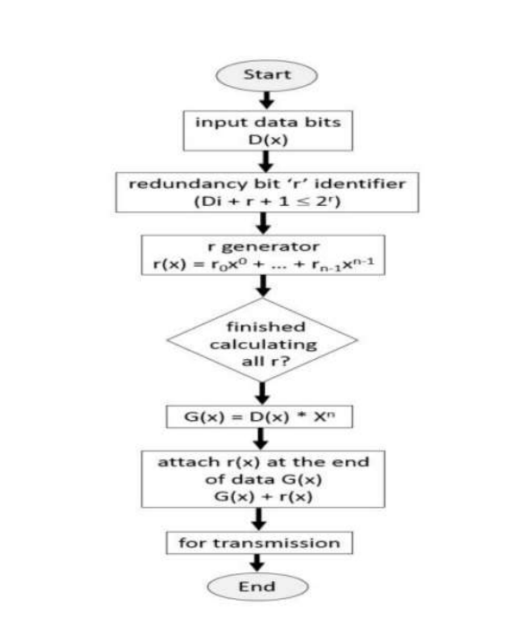

# EEDC Encoder

This project implements an Enhanced Error Detection and Correction (EEDC) Encoder to reduce redundancy bits in digital communication, improving over traditional Hamming Code and CRC methods. It includes FPGA implementation and simulations.

## Table of Contents
- [Problem Definition](docs/problem_definition.md)
- [Solution and Algorithm](docs/solution.md)
- [Results and Simulations](docs/results.md)
- [Conclusion](docs/conclusion.md)

## Quick Start
1. Clone the repository: `git clone https://github.com/<username>/EEDC-Encoder.git`
2. Open `src/` files in a Verilog simulator (e.g., Cadence).
3. Run test benches from `test/` to verify functionality.

