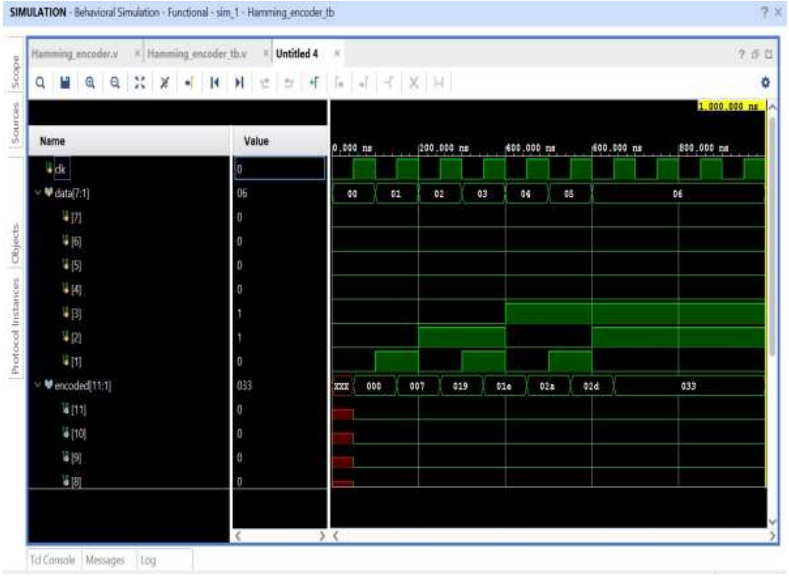
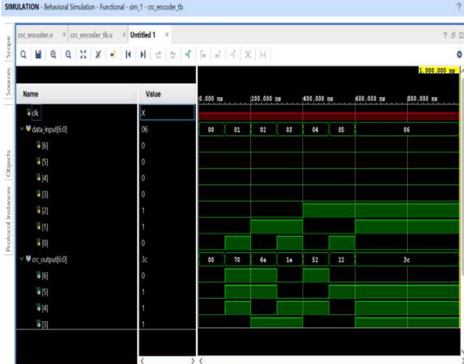
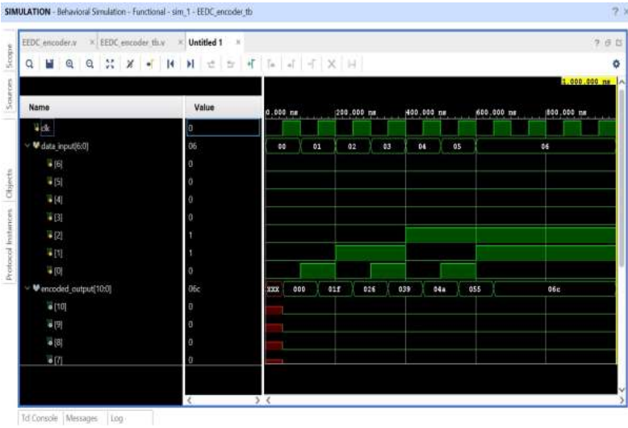

# Results and Simulations

## Simulation Waveforms

### Hamming Encoder

### CRC Encoder

### EEDC Encoder

## Analysis

The simulation results show that the EEDC encoder produces the desired output with fewer redundancy bits compared to traditional methods, while still maintaining high error detection accuracy. The comparisons of data rate and error detection performance further validate the effectiveness of the EEDC method.
